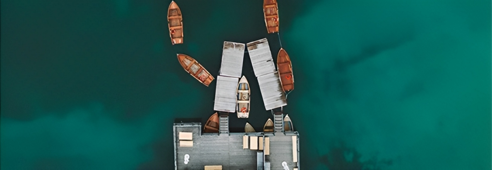

## Install
[VS Code](https://code.visualstudio.com/)


## Stage 1
 
Getting familiar with flexbox 
### HTML
```HTML
<!-- Main Blog -->
<div class="main">
    <ul class="blog-list">
    </ul>

    <div class="blog">
    </div>

    <div class="blog-content">
    </div>
</div>
```     
#### CSS
```css

.main {
    display: flex;
    flex-direction: row;
}

.blog-list {
    flex: 1;
    height: 50vh;
    margin-top: 20vh;
    display: flex;
    flex-direction: column;
    align-items: center;
    justify-content: center;
    padding: 0;
    border: 2px solid red;
}

.blog {
    flex: 5;
    padding-top: 20px;
    display: block;
    flex-direction: column;
    min-height: 90vh;
    border-right: solid 2px lightgray;
    border: 2px solid green;
}

.blog-content {
    flex: 2;
    height: 65vh;
    margin-top: auto;
    justify-content: center;
    align-items: center;
    padding: 40px;
    border: 2px solid blue;
}
```

## Stage 2

Creating a NavBar
#### HTML
```HTML
<!-- Nav Bar -->

<div class="main-nav">
    <div class="nav-flex">
        <div class="nav-item">Collections</div>
        <div class="nav-item">Most Popular</div>
    </div>
    <div class="nav-flex">
        <div class="nav-center">DEVCOM</div>
    </div>
    <div class="nav-flex">
        <div class="nav-item">My Account</div>
        <div class="nav-item">My Cart</div>
        <div class="search-btn"><i class="fa fa-search"></i></div>
    </div>
</div>
```

#### CSS
```css


.main-nav {
    background-color: white;
    color: #2a2a2a;
    padding: 5vh 2vw;
    top: 0;
    display: flex;
    flex-direction: row;
    z-index: 2;
    height: 7.5vh;
    border-bottom: 2px solid lightgray;
}
.nav-flex {
    display: flex;
    flex-direction: row;
    flex: 1;
}

.nav-item {
    padding: 2vh 2vw;
    font-weight: bold;
    font-size: medium;
    margin: auto;
}

.nav-center {
    font-weight: 900;
    font-size: 1.5vw;
    letter-spacing: 0.4vw;
    margin: auto;
}

.search-btn {
    background-color: black;
    width: 3.4vw;
    height: 3.4vw;
    margin: 0 4vw;
    display: flex;
    justify-content: center;
    align-items: center;
    text-align: center;
}

.search-btn .fa-search {
    color: white;
}
```

## Stage 3

Lists, Padding and Margin
#### HTML
```HTML
<!-- Main Blog -->
<ul class="blog-list">
    <li><a href="#">01</a></li>
    <li><a href="#">02</a></li>
    <li><a href="#">03</a></li>
    <li><a href="#">04</a></li>
    <li><a href="#">05</a></li>
</ul>   

<div class="blog">
    <div class="blog-info">Lorem ipsum dolor sit amet consectetur adipisicing elit. Nemo beatae eveniet magnam delectus eligendi nihil quo eius illum illo. Perferendis, totam quis eos molestias facilis incidunt optio. Voluptatibus incidunt repudiandae doloremque veniam.</div>
</div>
```
#### CSS
```css
a {
  color: black;
  text-decoration: none;
}

.blog-list li {
  flex: 25%;
}

.blog-list li a {
  font-size: 25px;
}

.blog-info{
  border: 2px solid blue;
  padding: 5vw;
  margin: 5vw;
}
```

## Stage 4

Your website is ready
#### HTML
```HTML
<div class="blog">
    <div class="date">
    <span>25th January, 2023</span></div>
    <div class="heading">
        <span>
        <h1>We Create A Modern Beautiful Blogging Website</h1>
        </span>
    </div>
    
</div>

<div class="blog-content">
    <div class="blog-info">
        <h3>Air Drone</h3>
        <div>
            We used a drone and took photos at differen time of the day. Do you
            go away often, and beautiful photos are your favourite souveniers
            from every vacation? Think about buying a drone.
        </div>
        </div>
        <div class="blog-info">
        <h3>Knowledge</h3>
        <div>
            We are a team of experienced people who implement the most advanced
            projects
        </div>
    </div>
</div>
```

#### CSS
```css
.blog img {
    width: 100%;
}

.blog .date {
    font-size: medium;
    color: gray;
}

.blog .heading {
    font-size: xx-large;
}

.blog-info {
    margin-top: 5vh;
}

.blog-info div {
    margin-top: 7px;
    color: gray;
}
```
